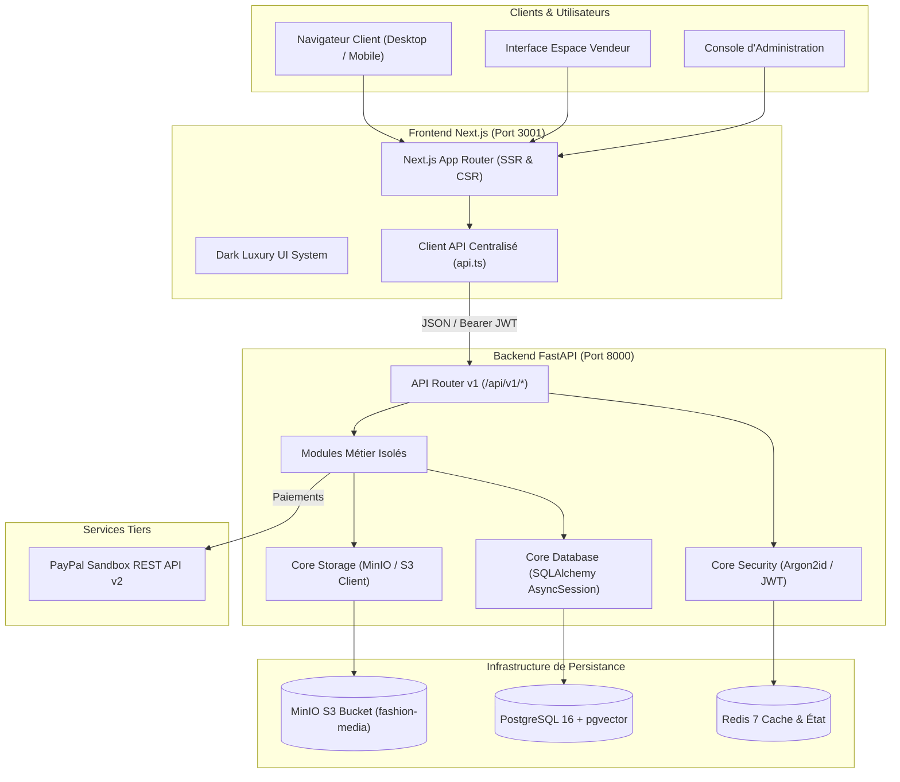
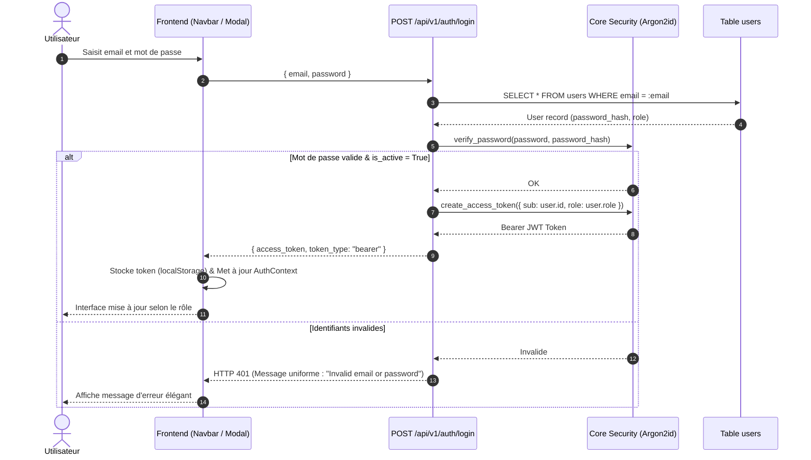

# MAISON — AI FASHION MARKETPLACE
# ARCHITECTURE TECHNIQUE & INGÉNIERIE LOGICIELLE

> **Document :** `docs/handover/ARCHITECTURE.md`  
> **Conception :** Monolythe Modulaire FastAPI & Frontend Next.js App Router

---

## 1. Vue d'Ensemble & Diagramme de Contexte Système



---

## 2. Architecture Backend : Le Monolythe Modulaire

Le backend suit le pattern architectural du **Monolythe Modulaire** afin d'assurer un cloisonnement strict des responsabilités sans surcoût d'infrastructure.

### 2.1 Structure des Répertoires
```
backend/
├── alembic/                      # Migrations de schéma de base de données
│   └── versions/                 # Scripts 0001 à 0008
├── app/
│   ├── api/
│   │   └── v1/
│   │       └── router.py         # Montage central des routeurs de modules
│   ├── core/                     # Socle d'infrastructure transverse
│   │   ├── config.py             # Validation pydantic-settings & secrets
│   │   ├── database.py           # Engine & SessionFactory SQLAlchemy async
│   │   ├── redis.py              # Pool de connexion Redis asynchrone
│   │   ├── security.py           # Hachage Argon2id & signatures JWT
│   │   └── storage.py            # Client MinIO/S3 pour les médias
│   ├── modules/                  # Domaines métier étanches
│   │   ├── admin/                # Modération stores, audit users, stats
│   │   ├── auth/                 # Enregistrement, login, tokens JWT
│   │   ├── cart/                 # Gestion des paniers clients
│   │   ├── catalog/              # Marques, catégories, produits, variantes, médias
│   │   ├── health/               # Diagnostics de disponibilité du système
│   │   ├── inventory/            # Mouvements de stock, réservations atomiques
│   │   ├── orders/               # Commandes, sous-commandes, fulfillment
│   │   ├── payments/             # Enregistrement paiements & passerelle PayPal
│   │   ├── search/               # Recherche à facettes & filtres
│   │   ├── seller/               # Tableau de bord vendeur & profil boutique
│   │   ├── stores/               # Consultation publique des vitrines vendeurs
│   │   └── users/                # Entité User et gestion de profil
│   └── main.py                   # Point d'entrée FastAPI, lifespan & CORS
└── tests/                        # Suite de 255 tests pytest
```

### 2.2 Règle d'Isolation en Couches
Chaque module métier respecte la hiérarchie stricte suivante :
```
[Routes HTTP (routes.py)]
         │
         ▼
[Schémas de Validation (schemas.py)]
         │
         ▼
[Logique Métier & Transactions (service.py)]
         │
         ▼
[Entités Relationnelles (models.py)]
```
* Les contrôleurs HTTP (`routes.py`) ne contiennent aucune requête SQL directe.
* Les transactions en base de données s'effectuent via `AsyncSession` passée par injection de dépendance.

---

## 3. Architecture Frontend : Next.js App Router

Le frontend utilise Next.js 15 avec l'App Router pour un rendu hybride performant et sécurisé.

### 3.1 Arborescence des Routes Client
```
frontend/src/
├── app/
│   ├── layout.tsx                # Layout racine (AuthProvider, FavoritesProvider, Navbar, CartDrawer, Footer)
│   ├── page.tsx                  # Page d'accueil Dark Luxury (Hero, Facettes, Nouveautés, Créateurs)
│   ├── globals.css               # Configuration Tailwind & tokens couleurs
│   ├── products/
│   │   └── [id]/page.tsx         # Fiche produit détaillée, sélection taille/couleur, avis stock
│   ├── store/
│   │   └── [slug]/page.tsx       # Vitrine publique créateur (Bannière, bio, catalogue de la marque)
│   ├── checkout/
│   │   └── page.tsx              # Tunnel de commande & bouton PayPal Sandbox
│   ├── orders/
│   │   ├── page.tsx              # Liste des commandes client
│   │   └── [id]/page.tsx         # Détail d'une commande (colis, tracking, articles)
│   ├── seller/
│   │   ├── dashboard/page.tsx    # Vue synthétique vendeur (KPIs, alertes)
│   │   ├── products/page.tsx     # Création et édition de pièces de mode
│   │   ├── inventory/page.tsx    # Gestion granulaire des stocks par SKU
│   │   ├── orders/page.tsx       # Expédition des commandes et saisie du tracking
│   │   └── settings/page.tsx     # Configuration de la boutique (logo, bannière)
│   └── admin/
│       ├── layout.tsx            # Protection de route administrateur
│       ├── dashboard/page.tsx    # Tour de contrôle de la marketplace
│       ├── stores/page.tsx       # Modération des boutiques créateurs
│       ├── users/page.tsx        # Gouvernance des comptes utilisateurs
│       └── orders/page.tsx       # Supervision globale des flux de commandes
├── components/                   # Composants réutilisables (Navbar, CartDrawer, Footer, StoreHeader...)
├── context/                      # Contextes d'état global client
│   ├── AuthContext.tsx           # Utilisateur connecté, token JWT, détection de rôle, panier
│   └── FavoritesContext.tsx      # Gestion locale SSR-safe de la wishlist (localStorage)
└── lib/
    └── api.ts                    # Client HTTP typé TypeScript pour l'ensemble des endpoints
```

---

## 4. Flux Fondamentaux en Diagrammes de Séquence

### 4.1 Flux d'Authentification & Autorisation (RBAC)



### 4.2 Flux de Commande Multi-Vendeurs & Réservation Atomique

```mermaid
sequenceDiagram
    autonumber
    actor C as Client
    participant CheckoutUI as Page /checkout
    participant OrdersMod as Module orders (Service)
    participant InvMod as Module inventory
    participant DB as PostgreSQL
    participant PP as Module payments (PayPal)

    C->>CheckoutUI: Clique "Confirmer la Sélection & Régler"
    CheckoutUI->>OrdersMod: POST /api/v1/orders/checkout
    
    rect rgb(20, 30, 45)
        Note over OrdersMod,DB: Transaction Atomique & Verrouillage
        OrdersMod->>DB: BEGIN TRANSACTION
        OrdersMod->>InvMod: check_and_reserve_stock(cart.items)
        InvMod->>DB: SELECT * FROM inventory_items WHERE variant_id IN (...) FOR UPDATE
        InvMod->>DB: UPDATE inventory_items SET reserved = reserved + qty
        OrdersMod->>DB: INSERT INTO orders (status: PENDING_PAYMENT)
        OrdersMod->>DB: INSERT INTO sub_orders (partitionné par seller_id)
        OrdersMod->>DB: INSERT INTO order_items (...)
        OrdersMod->>DB: COMMIT TRANSACTION
    end

    OrdersMod-->>CheckoutUI: Order créé (order_number, total, sub_orders)
    
    CheckoutUI->>PP: POST /api/v1/payments/paypal/create-order { order_id }
    PP-->>CheckoutUI: paypal_order_id
    CheckoutUI->>C: Affiche le bouton PayPal interactif
    C->>CheckoutUI: Confirme le paiement PayPal
    CheckoutUI->>PP: POST /api/v1/payments/paypal/capture-order { paypal_order_id }
    
    rect rgb(20, 30, 45)
        Note over PP,DB: Finalisation de la transaction
        PP->>DB: BEGIN TRANSACTION
        PP->>DB: UPDATE orders SET status = 'CONFIRMED'
        PP->>DB: INSERT INTO payments (status: 'COMPLETED')
        PP->>InvMod: finalize_stock_deduction(order_id)
        InvMod->>DB: UPDATE inventory_items SET quantity = quantity - qty, reserved = reserved - qty
        PP->>DB: COMMIT TRANSACTION
    end
    
    PP-->>CheckoutUI: Confirmation complète (Capture successful)
    CheckoutUI-->>C: Écran de confirmation de commande
```



---

## 5. Frontières de Sécurité & Gestion des Données

1. **Isolation des Données Vendeur :**
   * Un vendeur (`SELLER`) n'a accès qu'à ses propres articles et aux `SubOrder` qui lui sont assignées (`WHERE seller_id = current_user.id`).
   * Les modifications de stock ou de catalogue d'un autre créateur sont rejetées par HTTP 403 Forbidden.
2. **Isolation Client :**
   * Un client (`CUSTOMER`) ne peut consulter que ses propres paniers et commandes.
3. **Périmètre Administrateur :**
   * Les routes `/api/v1/admin/*` sont protégées par le middleware de rôle `require_roles([UserRole.ADMIN])`. Tout token de client ou de vendeur reçoit immédiatement une erreur 403.
4. **Validation des Fichiers Médias :**
   * Les fichiers téléversés sont vérifiés en mémoire sur deux niveaux : déclaration MIME et **signature d'en-tête (Magic Bytes)** pour JPEG, PNG et WebP, empêchant l'exécution d'exécutables maquillés.
