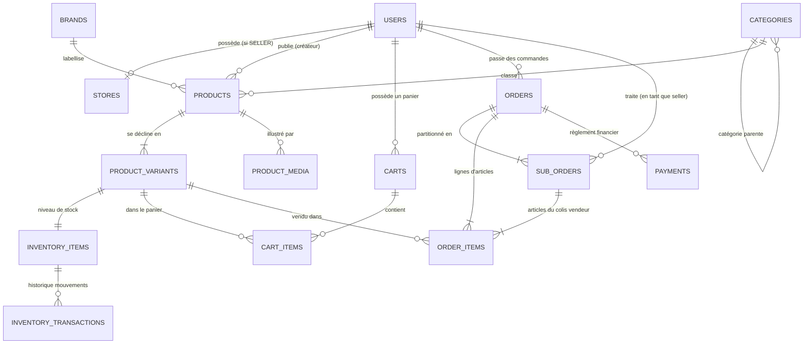

# MAISON — AI FASHION MARKETPLACE
# RÉFÉRENCE DE LA BASE DE DONNÉES & SCHÉMA RELATIONNEL

> **Document :** `docs/handover/DATABASE_REFERENCE.md`  
> **SGBD :** PostgreSQL 16 avec extension `pgvector`  
> **ORM & Driver :** SQLAlchemy 2.0 (Asynchrone via `asyncpg`) • **Migrations :** Alembic

---

## 1. Vue d'Ensemble & Diagramme Entité-Relation (ERD)



---

## 2. Inventaire Exhaustif des Tables & Modèles

### 2.1 Table `users` (Module `users`)
Stocke l'ensemble des comptes utilisateurs (clients, vendeurs créateurs, administrateurs).
* **Fichier source :** `backend/app/modules/users/models.py`
* **Migration initiale :** `0001_create_users_table.py`

| Colonne | Type SQL | Contraintes | Description |
| :--- | :--- | :--- | :--- |
| `id` | `UUID` | **PK**, Default: `uuid.uuid4` | Identifiant unique de l'utilisateur |
| `email` | `VARCHAR(255)` | **UNIQUE**, **INDEX**, Not Null | Adresse email de connexion (normalisée en minuscules) |
| `password_hash` | `VARCHAR(255)` | Not Null | Hachage sécurisé du mot de passe (Argon2id) |
| `first_name` | `VARCHAR(100)` | Not Null | Prénom ou prénom de contact |
| `last_name` | `VARCHAR(100)` | Not Null | Nom de famille ou raison sociale |
| `role` | `VARCHAR(20)` | **INDEX**, Not Null, Default: `CUSTOMER` | Rôle système : `CUSTOMER`, `SELLER`, `ADMIN` |
| `is_active` | `BOOLEAN` | Not Null, Default: `True` | Indicateur d'activation du compte (suspension possible) |
| `is_verified` | `BOOLEAN` | Not Null, Default: `False` | Indicateur de confiance / vérification d'identité |
| `created_at` | `TIMESTAMPTZ` | Not Null | Date de création du compte |
| `updated_at` | `TIMESTAMPTZ` | Not Null | Date de dernière mise à jour |

---

### 2.2 Table `stores` (Module `seller`)
Modélise la vitrine publique d'une Maison ou d'un créateur indépendant.
* **Fichier source :** `backend/app/modules/seller/models.py`
* **Migration :** `0008_create_stores_table.py`

| Colonne | Type SQL | Contraintes | Description |
| :--- | :--- | :--- | :--- |
| `id` | `UUID` | **PK**, Default: `uuid.uuid4` | Identifiant unique de la boutique |
| `seller_id` | `UUID` | **FK** (`users.id`, `ON DELETE RESTRICT`), **UNIQUE**, **INDEX** | Propriétaire créateur de la boutique |
| `store_name` | `VARCHAR(100)` | **UNIQUE**, **INDEX**, Not Null | Nom public de la Maison de couture |
| `slug` | `VARCHAR(120)` | **UNIQUE**, **INDEX**, Not Null | Identifiant d'URL unique (ex: `/store/atelier-valmont`) |
| `bio` | `TEXT` | Nullable | Manifeste de marque, histoire de l'atelier |
| `logo_url` | `VARCHAR(500)` | Nullable | URL publique du logo de la Maison |
| `logo_object_key` | `VARCHAR(255)` | Nullable | Clé d'objet S3 MinIO du logo |
| `banner_url` | `VARCHAR(500)` | Nullable | URL publique de la bannière héroïque |
| `banner_object_key` | `VARCHAR(255)` | Nullable | Clé d'objet S3 MinIO de la bannière |
| `status` | `VARCHAR(20)` | **INDEX**, Not Null, Default: `PENDING` | État opérationnel : `PENDING`, `APPROVED`, `SUSPENDED` |
| `is_verified` | `BOOLEAN` | **INDEX**, Not Null, Default: `False` | Badge officiel de Maison Certifiée (découplé du statut) |
| `contact_email` | `VARCHAR(255)` | Nullable | Email de conciergerie de la Maison |
| `created_at` | `TIMESTAMPTZ` | Not Null | Date de fondation de la vitrine |
| `updated_at` | `TIMESTAMPTZ` | Not Null | Dernière modification |

---

### 2.3 Tables du Catalogue (`catalog`)
* **Fichier source :** `backend/app/modules/catalog/models.py`
* **Migration :** `0002_create_catalog_tables.py`

#### Table `brands`
* `id` (`UUID`, PK)
* `name` (`VARCHAR(100)`, UNIQUE, INDEX, Not Null)
* `slug` (`VARCHAR(120)`, UNIQUE, INDEX, Not Null)
* `description` (`TEXT`, Nullable)
* `website_url` (`VARCHAR(255)`, Nullable)

#### Table `categories`
* `id` (`UUID`, PK)
* `name` (`VARCHAR(100)`, Not Null)
* `slug` (`VARCHAR(120)`, UNIQUE, INDEX, Not Null)
* `parent_id` (`UUID`, FK `categories.id`, `ON DELETE SET NULL`, Nullable) — Arborescence récursive sans auto-référence.

#### Table `products`
* `id` (`UUID`, PK)
* `seller_id` (`UUID`, FK `users.id`, `ON DELETE RESTRICT`, INDEX, Not Null)
* `brand_id` (`UUID`, FK `brands.id`, `ON DELETE SET NULL`, Nullable) — Optionnel pour les créateurs sans marque déposée.
* `category_id` (`UUID`, FK `categories.id`, `ON DELETE RESTRICT`, INDEX, Not Null)
* `name` (`VARCHAR(255)`, INDEX, Not Null)
* `slug` (`VARCHAR(280)`, UNIQUE, INDEX, Not Null)
* `description` (`TEXT`, Nullable)
* `base_price` (`NUMERIC(10, 2)`, Not Null, Check: `>= 0`)
* `currency` (`VARCHAR(3)`, Not Null, Default: `'USD'`)
* `status` (`VARCHAR(20)`, INDEX, Default: `'ACTIVE'`) — `DRAFT`, `ACTIVE`, `ARCHIVED`

#### Table `product_variants`
* `id` (`UUID`, PK)
* `product_id` (`UUID`, FK `products.id`, `ON DELETE CASCADE`, INDEX, Not Null)
* `sku` (`VARCHAR(64)`, UNIQUE, INDEX, Not Null) — Code SKU unique par variante.
* `size` (`VARCHAR(32)`, Nullable)
* `color` (`VARCHAR(32)`, Nullable)
* `price` (`NUMERIC(10, 2)`, Not Null, Check: `>= 0`)
* `compare_at_price` (`NUMERIC(10, 2)`, Nullable) — Prix barré authentique.
* `is_active` (`BOOLEAN`, Not Null, Default: `True`)

#### Table `product_media`
* `id` (`UUID`, PK)
* `product_id` (`UUID`, FK `products.id`, `ON DELETE CASCADE`, INDEX, Not Null)
* `media_type` (`VARCHAR(20)`, Default: `'IMAGE'`) — `IMAGE`, `VIDEO`, `LOOKBOOK`
* `url` (`VARCHAR(500)`, Not Null)
* `object_key` (`VARCHAR(255)`, Not Null)
* `position` (`INTEGER`, Default: `0`)
* `alt_text` (`VARCHAR(255)`, Nullable)

---

### 2.4 Tables d'Inventaire (`inventory`)
* **Fichier source :** `backend/app/modules/inventory/models.py`
* **Migration :** `0003_create_inventory_tables.py`

#### Table `inventory_items`
* `id` (`UUID`, PK)
* `variant_id` (`UUID`, FK `product_variants.id`, `ON DELETE RESTRICT`, UNIQUE, INDEX, Not Null)
* `quantity` (`INTEGER`, Not Null, Default: `0`, Check: `>= 0`) — Stock physique total disponible.
* `reserved_quantity` (`INTEGER`, Not Null, Default: `0`, Check: `>= 0`) — Stock temporairement verrouillé pendant les checkouts.
* `low_stock_threshold` (`INTEGER`, Not Null, Default: `2`)

#### Table `inventory_transactions`
* `id` (`UUID`, PK)
* `inventory_item_id` (`UUID`, FK `inventory_items.id`, `ON DELETE CASCADE`, INDEX, Not Null)
* `quantity_delta` (`INTEGER`, Not Null) — Variation positive ou négative.
* `transaction_type` (`VARCHAR(32)`, Not Null) — `INITIAL`, `RESTOCK`, `RESERVATION`, `RELEASE`, `ORDER_FULFILLMENT`, `ADJUSTMENT`
* `reference_id` (`VARCHAR(64)`, Nullable) — Référence de la commande ou de l'ajustement.

---

### 2.5 Tables du Panier (`cart`)
* **Fichier source :** `backend/app/modules/cart/models.py`
* **Migration :** `0004_create_cart_tables.py`

#### Table `carts`
* `id` (`UUID`, PK)
* `user_id` (`UUID`, FK `users.id`, `ON DELETE CASCADE`, UNIQUE, INDEX, Not Null)
* `currency` (`VARCHAR(3)`, Not Null, Default: `'USD'`)

#### Table `cart_items`
* `id` (`UUID`, PK)
* `cart_id` (`UUID`, FK `carts.id`, `ON DELETE CASCADE`, INDEX, Not Null)
* `variant_id` (`UUID`, FK `product_variants.id`, `ON DELETE RESTRICT`, INDEX, Not Null)
* `quantity` (`INTEGER`, Not Null, Check: `> 0`)
* Contrainte d'unicité : `UNIQUE (cart_id, variant_id)`

---

### 2.6 Tables de Commandes & Partitionnement Vendeurs (`orders`)
* **Fichier source :** `backend/app/modules/orders/models.py`
* **Migrations :** `0005_create_order_tables.py`, `0007_create_sub_orders_and_fulfillment.py`

#### Table `orders`
* `id` (`UUID`, PK)
* `customer_id` (`UUID`, FK `users.id`, `ON DELETE RESTRICT`, INDEX, Not Null)
* `order_number` (`VARCHAR(64)`, UNIQUE, INDEX, Not Null)
* `status` (`VARCHAR(32)`, INDEX, Default: `'PENDING_PAYMENT'`) — `PENDING_PAYMENT`, `CONFIRMED`, `PROCESSING`, `SHIPPED`, `DELIVERED`, `CANCELLED`
* `subtotal` (`NUMERIC(10, 2)`, Not Null, Check: `>= 0`)
* `total` (`NUMERIC(10, 2)`, Not Null, Check: `>= 0`)
* `currency` (`VARCHAR(3)`, Not Null, Default: `'USD'`)

#### Table `sub_orders` (Partitionnement multi-créateurs)
* `id` (`UUID`, PK)
* `order_id` (`UUID`, FK `orders.id`, `ON DELETE CASCADE`, INDEX, Not Null)
* `seller_id` (`UUID`, FK `users.id`, `ON DELETE RESTRICT`, INDEX, Not Null)
* `sub_order_number` (`VARCHAR(64)`, UNIQUE, INDEX, Not Null)
* `status` (`VARCHAR(32)`, Default: `'PENDING_PAYMENT'`)
* `subtotal` (`NUMERIC(10, 2)`, Not Null)
* `total` (`NUMERIC(10, 2)`, Not Null)
* `carrier` (`VARCHAR(100)`, Nullable) — Nom du transporteur (ex: DHL Express, FedEx Haute Sécurité).
* `tracking_number` (`VARCHAR(100)`, Nullable) — Numéro de suivi de colis.
* `shipped_at` (`TIMESTAMPTZ`, Nullable)
* `delivered_at` (`TIMESTAMPTZ`, Nullable)

#### Table `order_items`
* `id` (`UUID`, PK)
* `order_id` (`UUID`, FK `orders.id`, `ON DELETE CASCADE`, INDEX, Not Null)
* `sub_order_id` (`UUID`, FK `sub_orders.id`, `ON DELETE SET NULL`, INDEX, Nullable)
* `variant_id` (`UUID`, FK `product_variants.id`, `ON DELETE RESTRICT`, INDEX, Not Null)
* `seller_id` (`UUID`, FK `users.id`, `ON DELETE RESTRICT`, INDEX, Not Null)
* `product_name` (`VARCHAR(255)`, Not Null) — Snapshot textuel figé au moment de l'achat.
* `sku` (`VARCHAR(64)`, Not Null)
* `unit_price` (`NUMERIC(10, 2)`, Not Null)
* `quantity` (`INTEGER`, Not Null)
* `line_total` (`NUMERIC(10, 2)`, Not Null)

---

### 2.7 Table des Règlements Financiers (`payments`)
* **Fichier source :** `backend/app/modules/payments/models.py`
* **Migration :** `0006_create_payment_tables.py`

#### Table `payments`
* `id` (`UUID`, PK)
* `order_id` (`UUID`, FK `orders.id`, `ON DELETE RESTRICT`, UNIQUE, INDEX, Not Null)
* `amount` (`NUMERIC(10, 2)`, Not Null, Check: `> 0`)
* `currency` (`VARCHAR(3)`, Not Null)
* `provider` (`VARCHAR(32)`, Not Null, Default: `'PAYPAL'`)
* `provider_transaction_id` (`VARCHAR(128)`, UNIQUE, INDEX, Nullable)
* `status` (`VARCHAR(32)`, Not Null, Default: `'PENDING'`) — `PENDING`, `COMPLETED`, `FAILED`, `CANCELLED`

---

## 3. Historique & Ordre des Migrations Alembic

La base de données est versionnée séquentiellement par Alembic dans `backend/alembic/versions/` :

```
0001_create_users_table.py
  └─► 0002_create_catalog_tables.py
        └─► 0003_create_inventory_tables.py
              └─► 0004_create_cart_tables.py
                    └─► 0005_create_order_tables.py
                          └─► 0006_create_payment_tables.py
                                └─► 0007_create_sub_orders_and_fulfillment.py
                                      └─► 0008_create_stores_table.py (HEAD)
```

Pour inspecter la révision courante sans modifier la base :
```bash
./.venv/bin/alembic -c backend/alembic.ini current
```
Pour appliquer les migrations sur une base fraîche :
```bash
./.venv/bin/alembic -c backend/alembic.ini upgrade head
```

---

## 4. Statut pgvector & Recommandations de Sauvegarde

1. **Extension pgvector :**
   * L'image Docker utilise `pgvector/pgvector:pg16`.
   * L'extension est activée à l'initialisation de PostgreSQL (`init-db.sql` : `CREATE EXTENSION IF NOT EXISTS vector;`).
   * Les tables actuelles n'ont pas encore de colonne `Vector(dimension)`.
2. **Stratégie de Sauvegarde :**
   * Exporter un snapshot cohérent :
     ```bash
     docker exec -t fashion-postgres pg_dump -U postgres -d fashion_marketplace -F c -b -v -f /tmp/backup_fashion.dump
     ```
