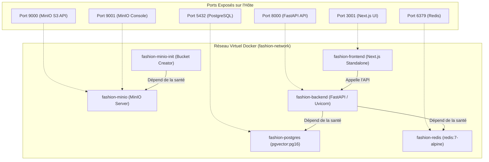

# MAISON — AI FASHION MARKETPLACE
# INFRASTRUCTURE DEVOPS, CONTENEURISATION & DÉPLOIEMENT

> **Document :** `docs/handover/DEVOPS_AND_DEPLOYMENT.md`  
> **Statut :** Conteneurisation locale opérationnelle • CI/CD Cloud à configurer

---

## 1. État des Lieux des Composants DevOps

| Composant | Statut Vérifié | Détails d'Implémentation & Preuves |
| :--- | :--- | :--- |
| **Backend Dockerfile** | **Configuré & Vérifié** | `backend/Dockerfile` (Python 3.12-slim, non-root `appuser` uid 1000, healthcheck curl) |
| **Frontend Dockerfile** | **Configuré & Vérifié** | `frontend/Dockerfile` (Multi-stage Node 20-alpine, non-root `nextjs`, build standalone) |
| **Docker Compose** | **Configuré & Vérifié** | `docker-compose.yml` (orchestre postgres, redis, minio, minio-init, backend, frontend) |
| **Service Base de Données** | **Configuré & Vérifié** | `pgvector/pgvector:pg16` avec volume persistant `postgres_data` et init-db.sql |
| **Service Cache** | **Configuré & Vérifié** | `redis:7-alpine` avec volume persistant `redis_data` et healthcheck `redis-cli ping` |
| **Service Stockage Objet** | **Configuré & Vérifié** | `elestio/minio:latest` + conteneur `minio-init` pour créer le bucket `fashion-media` |
| **Pipelines CI/CD (GitHub Actions)** | **Manquant** | Aucun dossier `.github/workflows/` présent dans le dépôt Git |
| **Déploiement Cloud (Kubernetes/IaC)** | **Manquant** | Aucun manifeste Terraform, Helm ou CloudFormation n'est versionné |
| **Monitoring & Traçabilité (APM)** | **Partiellement configuré** | Logs structurés Python console (`logging`), pas de connecteur Prometheus ou Sentry |

---

## 2. Architecture de Conteneurisation (`docker-compose.yml`)

Le fichier `docker-compose.yml` définit l'écosystème complet pour un démarrage reproductible :



### Commandes DevOps de Référence :
```bash
# Lancement de l'infrastructure socle uniquement (développement hybride)
docker compose up -d postgres redis minio minio-init

# Lancement de l'intégralité de la marketplace sous Docker
docker compose up -d --build

# Inspection des logs d'un service spécifique
docker compose logs -f backend

# Arrêt propre sans destruction des données
docker compose stop

# Arrêt complet et suppression des conteneurs (en préservant les volumes)
docker compose down
```

---

## 3. Feuille de Route d'Industrialisation DevOps (Roadmap)

Le repreneur doit prioriser les 4 chantiers d'industrialisation suivants :

### Étape 1 : Créer le Pipeline d'Intégration Continue (GitHub Actions)
Créer le fichier `.github/workflows/ci.yml` pour exécuter automatiquement sur chaque Pull Request :
1. **Lint & Whitespace :** `git diff --check`, `npm run lint`.
2. **Type Checking :** `npx tsc --noEmit`.
3. **Tests Backend :** Démarrer un conteneur Postgres et lancer `./.venv/bin/pytest backend/tests`.
4. **Build Frontend :** `npm run build`.

### Étape 2 : Analyse de Vulnérabilités & Sécurité des Conteneurs
* Intégrer **Trivy** ou **Docker Scout** dans la CI pour scanner les dépendances Python (`pip-audit`), npm (`npm audit`) et les couches d'images de base.

### Étape 3 : Déploiement Staging / Production
* **Backend :** Déployer sur un cluster managé (AWS ECS / Fargate, Google Cloud Run ou Kubernetes) avec injection des variables d'environnement via un gestionnaire de secrets (AWS Secrets Manager, Doppler ou HashiCorp Vault).
* **Frontend :** Déployer sur Vercel ou conteneur standalone derrière un CDN Cloudflare.
* **Base de Données :** Utiliser une instance managée PostgreSQL (AWS RDS ou Supabase avec extension `vector` activée) avec sauvegardes quotidiennes automatisées et PITR (Point-in-Time Recovery).
* **Stockage Média :** Remplacer MinIO par un bucket AWS S3 ou Cloudflare R2 avec distribution CloudFront / CDN sous nom de domaine personnalisé (`media.maison.luxury`).

### Étape 4 : Observabilité & Monitoring
* **Gestion des Erreurs :** Intégrer le SDK Sentry côté FastAPI (`sentry-sdk[fastapi]`) et côté Next.js (`@sentry/nextjs`).
* **Métriques :** Exposer `/metrics` via `prometheus-fastapi-instrumentator` pour surveiller la latence des requêtes, le taux d'erreur 5xx et l'utilisation du pool de connexions `asyncpg`.
