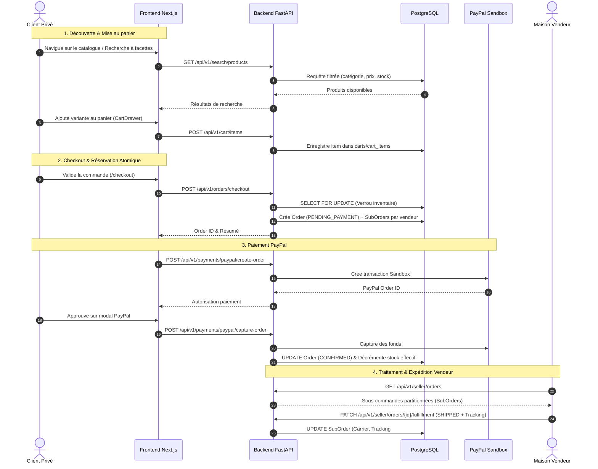

# MAISON — AI FASHION MARKETPLACE
# PRÉSENTATION FONCTIONNELLE & PÉRIMÈTRE MÉTIER

> **Document :** `docs/handover/PROJECT_OVERVIEW.md`  
> **Contexte :** Plateforme e-commerce Haute Couture & Créateurs Indépendants

---

## 1. Vision & Mission Produit

**Maison** est une place de marché numérique d'exception dédiée aux maisons de mode indépendantes, tailleurs sur mesure et marques émergentes de prêt-à-porter de luxe.

Contrairement aux marketplaces généralistes :
* L'identité visuelle est résolument **« Dark Luxury »** : fond charbon, typographie serif élégante, contrastes ivoire et touches or champagne.
* L'accent est mis sur la **traçabilité**, la **rareté des pièces**, la **transparence des ateliers** et la **réservation transactionnelle garantie**.
* Chaque créateur dispose de sa propre vitrine numérique (Storefront public) tout en s'intégrant au catalogue global de la Maison.
* La gouvernance de la plateforme est assurée par un espace d'administration permettant de modérer les boutiques, d'auditer les comptes et de surveiller les flux financiers.

---

## 2. Personas & Acteurs du Système

Le système modélise trois profils d'utilisateurs distincts via l'énumération `UserRole` :

```
                  ┌────────────────────────────────────────┐
                  │       ÉCOSYSTÈME MAISON                │
                  └──────────────────┬─────────────────────┘
                                     │
         ┌───────────────────────────┼───────────────────────────┐
         ▼                           ▼                           ▼
┌──────────────────┐       ┌──────────────────┐       ┌──────────────────┐
│     CUSTOMER     │       │      SELLER      │       │      ADMIN       │
│  (Client Privé)  │       │ (Maison / Brand) │       │   (Gouvernance)  │
├──────────────────┤       ├──────────────────┤       ├──────────────────┤
│• Découverte      │       │• Vitrine/Store   │       │• Supervision     │
│• Recherche/Filtre│       │• Gestion pièces  │       │• Modération store│
│• Wishlist/Panier │       │• Gestion stock   │       │• Audit users     │
│• Paiement PayPal │       │• Expédition colis│       │• Suivi commandes │
│• Suivi commandes │       │• Suivi financier │       │• Paramétrage     │
└──────────────────┘       └──────────────────┘       └──────────────────┘
```

### 1. Le Client Privé (`CUSTOMER`)
* Découvre les collections via une page d'accueil éditoriale riche en filtres (catégories, marques, gammes de prix, tailles, couleurs, disponibilité en stock).
* Enregistre ses pièces favorites dans une wishlist locale sécurisée persistée.
* Gère son panier en temps réel via un volet latéral coulissant (`CartDrawer`).
* Valide sa commande avec réservation atomique de stock et règle par PayPal Sandbox.
* Suit l'avancement de ses colis multi-créateurs dans son espace personnel (`/orders`).

### 2. Le Vendeur Créateur (`SELLER`)
* Personnalise sa boutique publique (`Store`) : nom, slug d'accès unique, logo, bannière héroïque et manifeste de marque.
* Publie et maintient son catalogue de produits (`Product`) et variantes de taille/couleur (`ProductVariant`).
* Téléverse des médias visuels haute résolution (`ProductMedia`) validés par analyse de type MIME et magic bytes vers MinIO.
* Gère l'inventaire unitaire (`InventoryItem`) et suit l'historique des mouvements de stock (`InventoryTransaction`).
* Reçoit des sous-commandes partitionnées (`SubOrder`) et saisit les informations d'expédition (transporteur, numéro de suivi).

### 3. L'Administrateur Plateforme (`ADMIN`)
* Accède à la console d'administration sécurisée (`/admin/dashboard`).
* Supervise les indicateurs de performance de la marketplace (GMV, volume de commandes, créateurs actifs).
* Modère les boutiques créateurs : transition d'état (`PENDING` ➔ `APPROVED` ➔ `SUSPENDED`) et attribution du badge certifié (`is_verified`).
* Gère les comptes utilisateurs (activation, suspension, consultation des profils).
* Inspecte l'ensemble des commandes globales et sous-commandes avec filtres multi-critères.

---

## 3. Parcours Métier Principaux (Workflows)



---

## 4. Séparation Responsabilités Backend / Frontend

| Composant | Rôle Architectural | Technologies & Outils |
| :--- | :--- | :--- |
| **API Backend** | Logique métier stricte, règles d'intégrité, sécurité, calculs financiers, transactions atomiques, permissions RBAC | Python 3.12, FastAPI, SQLAlchemy 2.0 async, Pydantic v2, Alembic |
| **Client Frontend** | Expérience utilisateur, UI Dark Luxury, navigation dynamique, synchronisation panier et filtres, SSR/CSR équilibré | Next.js 15 (App Router), TypeScript, Tailwind CSS, Lucide Icons |
| **Persistance** | Stockage relationnel ACID, contraintes d'unicité et de clés étrangères, verrous de ligne pour la concurrence | PostgreSQL 16 (avec extension pgvector préinstallée) |
| **Cache & État** | Gestion des sessions asynchrones, invalidation de cache, limitation de débit future | Redis 7 Alpine |
| **Stockage Média** | Hébergement d'objets pour les visuels de pièces de mode, bannières et logos | MinIO S3 API |
| **Paiement** | Passerelle de paiement e-commerce avec séparation stricte des flux client/serveur | PayPal REST SDK Sandbox v2 |

---

## 5. Décisions d'Architecture Majeures & Rationale

1. **Monolythe Modulaire plutôt que Microservices prématurés :**
   * *Rationale :* Évite les coûts de latence réseau, d'orchestration distribuée et de cohérence éventuelle sur les stocks lors de la phase initiale du produit.
   * *Implémentation :* Chaque domaine (`auth`, `catalog`, `inventory`, `cart`, `orders`, `payments`, `seller`, `stores`, `admin`) vit dans `backend/app/modules/<module>/` avec ses propres routes, schémas, modèles et services isolés.

2. **Réservation de Stock Atomique (`SELECT FOR UPDATE`) :**
   * *Rationale :* Dans la Haute Couture, les pièces sont produites en quantités très limitées (souvent 1 à 3 unités par taille). Le risque de « survente » (overselling) sous forte charge est inacceptable.
   * *Implémentation :* Le service d'inventaire verrouille les lignes correspondantes en base lors de l'appel `/checkout` et libère immédiatement la réservation en cas d'annulation ou d'expiration de session.

3. **Partitionnement des Commandes en Sous-Commandes Vendeurs (`SubOrder`) :**
   * *Rationale :* Un client peut acheter une robe d'une Maison à Paris et un sac d'un créateur à Milan dans le même panier. Chaque créateur doit uniquement voir ses propres articles, expédier son colis et renseigner son propre numéro de suivi.
   * *Implémentation :* L'entité parente `Order` regroupe les totaux financiers et le paiement global, tandis que `SubOrder` partitionne les lignes de commande par `seller_id`.

4. **Argon2id pour le Hachage des Mots de Passe :**
   * *Rationale :* Recommandation OWASP de premier rang pour contrer les attaques par dictionnaire assistées par GPU et FPGA.

---

## 6. Limites Actuelles & Scope Futur

* **État de la couche IA :** Les dépendances logicielles (`pgvector`) et le conteneur Docker sont en place, mais aucune colonne vectorielle ni pipeline d'inférence d'embeddings (CLIP / ResNet) n'est encore rattaché aux modèles de catalogue.
* **Notification par email :** Les commandes sont créées en base mais aucun serveur SMTP / provider transactionnel (Resend, SendGrid) n'est pour l'instant branché.
* **Créateurs initiaux :** La base de données de test contient 24 produits et 22 marques/catégories, mais la table `stores` ne compte pas de profil de boutique initialement instancié. Les vendeurs doivent créer leur vitrine via `/seller/dashboard`.
